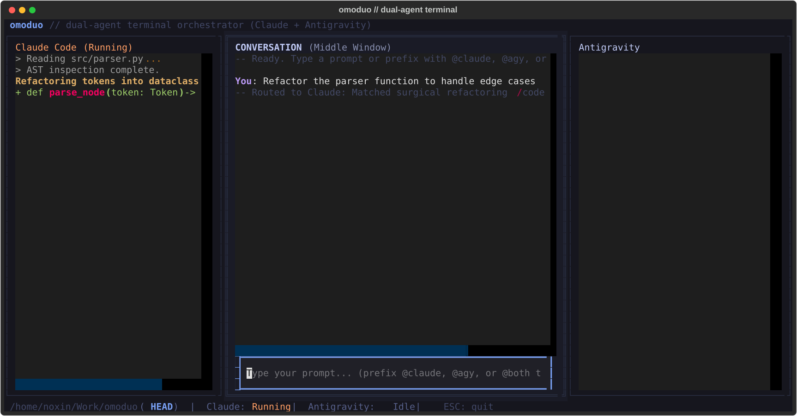

# omoduo

A lightweight, native terminal TUI orchestrator pairing **Claude Code** and **Antigravity (Gemini)** side-by-side on Omarchy.

Built with Python's [Textual](https://github.com/Textualize/textual) framework.

```
+-------------------+-----------------------------------+-------------------+
|  [CLAUDE WORK]    |      [UNIFIED CONVERSATION]       |  [ANTIGRAVITY]    |
|                   |                                   |                   |
| Live tool calls,  | Central back-and-forth log.       | Live tool calls,  |
| reasoning trace,  | Dispatches tasks and synthesizes  | repo search,      |
| surgical edits.   | responses.                        | context scans.    |
|                   |                                   |                   |
| (Blank if idle)   | [Input prompt box...]             | (Blank if idle)   |
+-------------------+-----------------------------------+-------------------+
| Engine: Running   | CWD / Git branch                  | Engine: Idle      |
+-------------------+-----------------------------------+-------------------+
```



## Features

- **3-Pane Layout**: The central conversation pane is flanked by live streaming work response windows for each engine. If an engine is not called, its window remains blank.
- **Autonomous Intent Routing**: Classifies tasks by shape:
  - Repo exploration, architecture scans, and broad searches route to **Antigravity**.
  - Surgical code edits, bug fixes, test generation, and strict typing route to **Claude Code**.
  - Cooperative multi-stage tasks (context research then implementation) trigger a staged collaboration pass.
- **Manual Overrides**: Prefix prompts with `@claude`, `@agy`, or `@both` to override routing.
- **Tokyo Night Palette**: Designed to match the Omarchy desktop aesthetic.
- **Lightweight**: Pure terminal TUI running in ~25 MB RAM.

## Installation & Running

The runner script is symlinked to `~/.local/bin/omoduo`.

```bash
# Run directly from any terminal
omoduo

# Or run from source
cd ~/Work/omoduo
./bin/omoduo
```

## Keybindings

| Key | Action |
|---|---|
| `Enter` | Submit prompt from the input field |
| `Ctrl+L` | Clear work response panes |
| `Esc` / `Ctrl+C` | Quit |

## Running Tests

```bash
cd ~/Work/omoduo
.venv/bin/pytest -v
```
